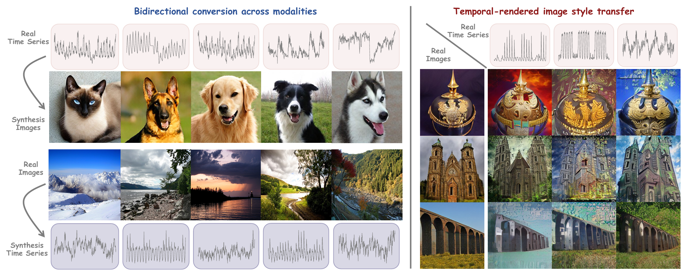
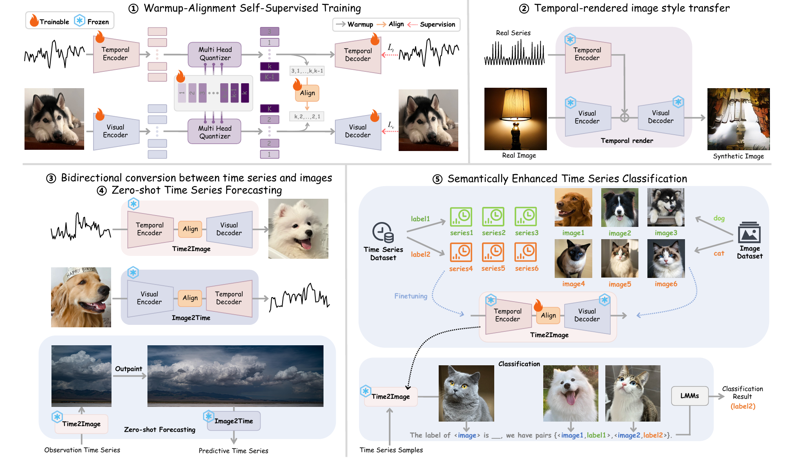
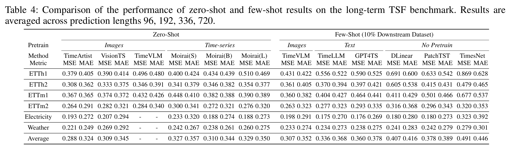
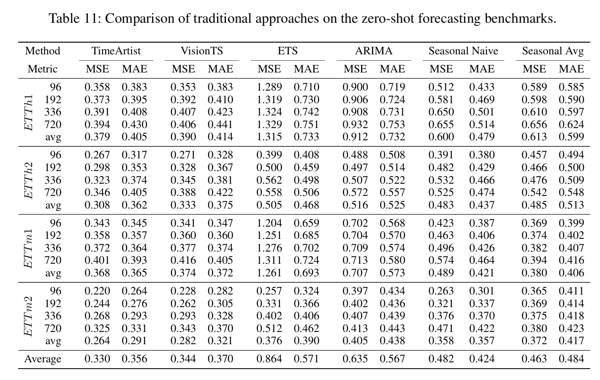
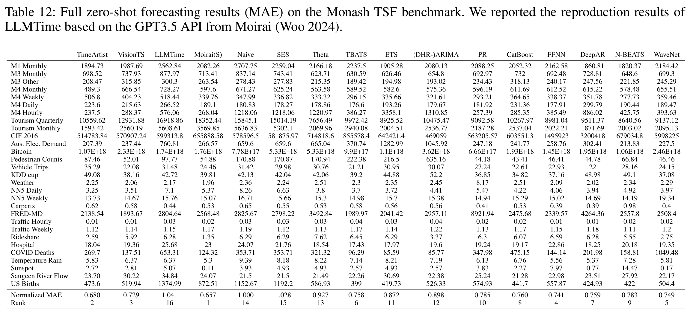
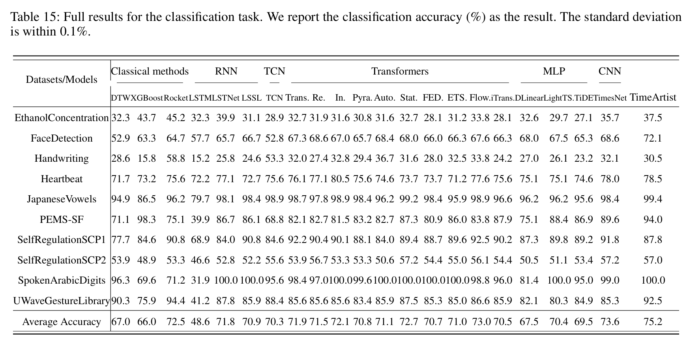

# TimeArtist (Submitted to AAAI 2026)

### This is an offical implementation of "TimeArtist: Temporal-Visual Multimodal Conversion for Zero-Shot Time Series Forecasting and Classification with Pretrained Vision Models"

[//]: # (:triangular_flag_on_post: Our model has been included in [GluonTS]&#40;https://github.com/awslabs/gluonts&#41;. Special thanks to the contributor @[kashif]&#40;https://github.com/kashif&#41;!)

[//]: # (:triangular_flag_on_post: Our model has been included in [NeuralForecast]&#40;https://github.com/Nixtla/neuralforecast&#41;. Special thanks to the contributor @[kdgutier]&#40;https://github.com/kdgutier&#41; and @[cchallu]&#40;https://github.com/cchallu&#41;!)

[//]: # (:triangular_flag_on_post: Our model has been included in [timeseriesAI&#40;tsai&#41;]&#40;https://github.com/timeseriesAI/tsai/blob/main/tutorial_nbs/15_PatchTST_a_new_transformer_for_LTSF.ipynb&#41;. Special thanks to the contributor @[oguiza]&#40;https://github.com/oguiza&#41;!)


This paper introduces TimeArtist, the first general-purpose Temporal-Visual Multimodal (TVM) model that aligns temporal fluctuations in time series with visual semantics. Unlike prior methods that convert time series into pseudo-images lacking semantic meaning, TimeArtist establishes a unified discrete representation space through a two-stage "warmup-align" paradigm:
1. Warmup Phase: Self-supervised training of dual-autoencoders (for time series and images) and a shared quantizer on large-scale datasets.
2. Alignment Phase: A projection module aligns temporal and visual representations in the latent space without paired data.



## Key Innovations:

:star1: **Bidirectional Conversion**: Enables bidirectional transformation between 1d time series and 2d images while preserving temporal patterns in the synthesis image (e.g., rendering temporal-styled images).

:star1: **Multi Head Quantization (MHQ)**: Improves codebook utilization by modeling hierarchical representation (e.g., trends/seasonality in time series, semantics/pixels in images).

:star1: **Zero-shot Forecasting and Classification**: Leverages pretrained vision models by reframing forecasting as image outpainting and classification as visual category, achieving state-of-the-art performance.




## Visualization:


As the training steps increases, TimeArtist initially generates standardized semantic representations—images conforming to universal cognitive patterns of objects like cats or dogs. Subsequently, it progressively learns fine-grained mapping relationships between individual time series and specific images, thereby producing diversified visual outputs.


The visualization results of time-series-based image style transfer are demostrated. For each subplot, the leftmost position displays the original image, followed by 10 synthesized images incorporating temporal representations.


## Results:

:star2: **Outperforms** diffusion/autoregressive baselines in image generation (e.g., gFID 3.29 vs. LDM 3.60) and time-series forecasting (e.g., 20% lower MSE than VisionTS on Monash benchmarks).

:star2: **Achieves** 90%+ codebook utilization and generation efficiency (e.g., 145× faster generation than LDM).

### Zero-shot Forecasting on the Long-term TSF Benchmarks





### Zero-shot Forecasting on the Monash Benchmarks



### Classification



## Quickly Start

1. Install requirements. 

```
conda create -n timeartist python=3.10
conda activate timeartist
pip install -r requirements.txt
```

3. Download data. You can download all the datasets from LongTerm TSF Benchmarks, Chronos and ImageNet-1k. Create a seperate folder ```./dataset``` and put all files in the directory.

4. Training. We have summarized the hyperparameters in files ```./stage1/timeartist_b64_512.yaml``` and ```./stage1/timeartist_b64_512_align.yaml```, and have saved the training frameworks for the warm-up stage and the alignment stage in ```train_timeartist.py``` and ```train_timeartist_align.py```. Specifically, we trained TimeArtist using the following commands.

```
bash ./stage1_512.sh

bash ./stage2_512_align.sh
```

## Load the pre-trained parameters to run the instance

We have uploaded the pre-trained parameters to [HuggingFace](https://huggingface.co/TimeArtist). You can download the above files and save them in the following directory.

```
checkpoints
├── stage1
│   └── model.safetensors
├── stage2
│   └── pytorch_model.bin
└── tokenizer_vm_b64_imagenet
    ├── config.json
    └── model.safetensors
```


```
import os
import torch
from PIL import Image
from torchvision import transforms as T
from omegaconf import OmegaConf
from safetensors.torch import load_file

from modeling_for_vision.vision_model import VisionModel
from modeling.time_artist import TimeArtist

device = "cuda"

def plot_true_recon(orig, long=8, short=5, ylim=False, color=None, recon=None, save_name=None, show_legend=True):
    import numpy as np
    import matplotlib.pyplot as plt

    plt.figure(figsize=(long, short))
    plt.plot(
        np.arange(orig.shape[0]),
        orig,
        linewidth=0.5,
        label='Original',
        color=color if save_name is not None else 'lightsteelblue',
    )
    if recon is not None:
        plt.plot(
            np.arange(recon.shape[0]),
            recon,
            linewidth=1,
            label='Reconstruct',
            color='firebrick',
        )

    if ylim:
        min = np.min(np.array(orig))
        max = np.max(np.array(orig))
        y_min = min - (max-min)/3
        y_max = max + (max-min)/3
        plt.ylim(y_min, y_max)

    if show_legend:
        plt.legend()
    if save_name is not None:
        plt.savefig(save_name + '.png', bbox_inches='tight', pad_inches=0.05, dpi=1000)
    # plt.show()
    plt.close()
```

### 1. Load the Visual Autoencoder

```
tokenizer_visual = VisionModel.from_pretrained(f"checkpoints/tokenizer_vm_b64_imagenet")
tokenizer_visual.eval()
tokenizer_visual.requires_grad_(False)
tokenizer_visual = tokenizer_visual.to(device)
```

### 2. Load Times Series Autoencoder

```
config_path = './configs/stage1/timeartist_b64_512.yaml'
weight_path = './checkpoints/stage1/model.safetensors'
config = OmegaConf.load(config_path)
tokenizer_time = TimeArtist(config)
state_dict = load_file(weight_path)
tokenizer_time.load_state_dict(state_dict)
tokenizer_time.eval()
tokenizer_time.requires_grad_(False)
tokenizer_time = tokenizer_time.to(device)
```

### 3. Convert the image to a time series

```
# 3.1 Load any-sized image from the assets directory and convert it to a time series
transform = T.Compose([
    T.Resize((256, 256)),
    T.CenterCrop((256, 256)),
    T.ToTensor()
])

os.makedirs(f'./visualization/image2time', exist_ok=True)
image_list = os.listdir('assets')
for img_name in image_list:
    img_path = f'_images/{img_name}'
    image = transform(Image.open(img_path)).to(device)
    image = image.unsqueeze(0) / 255.0
    q, _ = tokenizer_visual.encode(image)

    # 3.2 Reconstruct the discrete representation of the image back into a time series sample and save it
    series_recon = tokenizer_time.decode(q)
    plot_true_recon(
        orig=series_recon[0].cpu(),
        long=4,
        short=4,
        ylim=True,
        color='cornflowerblue',
        save_name=f'./visualization/image2time/{img_name}_series',
        show_legend=False,
    )
```

### 4. Before alignment, convert the time series into an image

```
from data.data_loader import MultiDomainSelfSupervisionDataset
# for data_name in ['etth1', 'etth2', 'ettm1', 'ettm2', 'electricity', 'traffic', 'pems']:
for data_name in ['etth1']:
    dataset = MultiDomainSelfSupervisionDataset(data_name=data_name, seq_len=512)
    os.makedirs(f'visualization/series2image/{data_name}', exist_ok=True)
    for i in range(min(len(dataset), 10)):
        series = dataset.__getitem__(i)
        series = series.unsqueeze(0).to(device).float()
        q, q_ind = tokenizer_time.encode(series)
        image = tokenizer_visual.decode(q)
        image = torch.clamp(image, 0.0, 1.0)
        image = (image * 255.0).permute(0, 2, 3, 1).to("cpu", dtype=torch.uint8).numpy()[0]
        Image.fromarray(image).save(f'visualization/series2image/{data_name}/{i}_image.png')
        plot_true_recon(orig=series[0].cpu(), save_name=f'visualization/series2image/{data_name}/{i}_series', show_legend=False)
```

### 5. After alignment, the time series is converted into an image.

```
from modeling.alignment import AdapterAlignment

# 5.1 Load Times Series Alignment
config_path = './configs/stage2/timeartist_b64_512_align.yaml'
config = OmegaConf.load(config_path)
align_time2image = AdapterAlignment(config)
state_dict = torch.load(f'checkpoints/stage2/pytorch_model.bin')
align_time2image.load_state_dict(state_dict)
align_time2image.eval()
align_time2image.requires_grad_(False)
align_time2image = align_time2image.to(device)

# 5.2 Reconstruct the discrete representation of the aligned time series back into image samples and save them.
# for data_name in ['etth1', 'etth2', 'ettm1', 'ettm2', 'electricity', 'traffic', 'pems']:
for data_name in ['etth1']:
    dataset = MultiDomainSelfSupervisionDataset(data_name=data_name, seq_len=512)
    os.makedirs(f'visualization/series2image_align/{data_name}', exist_ok=True)
    for j in range(min(len(dataset), 10)):
        series = dataset.__getitem__(j)
        series = series.unsqueeze(0).to(device).float()
        q, q_ind = tokenizer_time.encode(series)
        logits = align_time2image.forward(q_ind)
        image_q_ind = torch.argmax(logits, dim=-1)
        image = tokenizer_visual.decode_tokens(image_q_ind)
        image = torch.clamp(image, 0.0, 1.0)
        image = (image * 255.0).permute(0, 2, 3, 1).to("cpu", dtype=torch.uint8).numpy()[0]
        Image.fromarray(image).save(f'visualization/series2image_align/{data_name}/{j}_image.png')
        plot_true_recon(
            series[0].cpu(),
            save_name=f'visualization/series2image_align/{data_name}/{j}_series',
            show_legend=False
        )
```